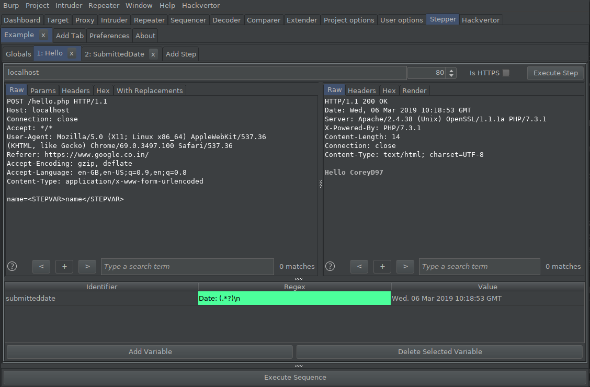

## Stepper
##### A Multi-Stage Repeater Replacement For Burp Suite
**Created By: [@CoreyD97](https://twitter.com/CoreyD97)**

*Stepper is designed to be a natural evolution of Burp Suite's Repeater tool, providing the ability to create sequences of steps and define regular expressions to extract values from responses which can then be used in subsequent steps.*
  
  
*A step utilising a global variable and defining a new variable for use in later steps.*

**Instructions:**
1. Create a new sequence. Double-click the title to set a suitable name.
2. Optional: Configure the global variables to use for the sequence.
3. Add your steps to the sequence manually, or using the context menu entry.
4. Optional: Define variables for steps, providing a regular expression which will be used to extract the values from the response.
   Tip: You can execute a single step to test your regular expressions using the button in the top right.
5. Execute the entire sequence using the button at the bottom of the panel.

**Variables:**  
Variables can be defined for use within a sequence. Variables consist of an identifier and a regular expression, or in the case of initial variables defined in the Globals tab, an identifier and value.
Step variables, defined with a regular expression, have their values set from the response of the step in which they are defined. The variable is then available for use within the request of subsequent steps after their definition.
However, Global variables, defined with a literal initial value, can be used throughout the sequence.

Both step and global variables may be updated in later steps after their definition.

**Regular Expression Variables:**  
Variables which are defined with a regular expression are updated each time the step in which they are defined is executed.
The regular expression is executed on the response received, with the first match being used as the new value.
If the defined regular expression has no groups defined, the whole match will be used.
If the regular expression defines capture groups, the first group will be used.
If groups are required but should not be used as the value, a non-capturing group may be used. e.g. (?:REGEX)

**Example:**   
Response: "Hello People, Hello World!"  
Expression: World|Earth, Result: World  
Expression: Hello (World|Earth)!, Result: World  
Expression: (?:Goodbye|Hello) (World)!, Result: World

**Variable Usage:**  
To use a variable in a request after it has been defined, either use the option in the context menu to copy the parameter to the clipboard, or manually insert it by including it as below:

*\<STEPVAR>VARIABLE_IDENTIFIER\</STEPVAR>*

**Future Plans:**  
* Allow steps to be reordered